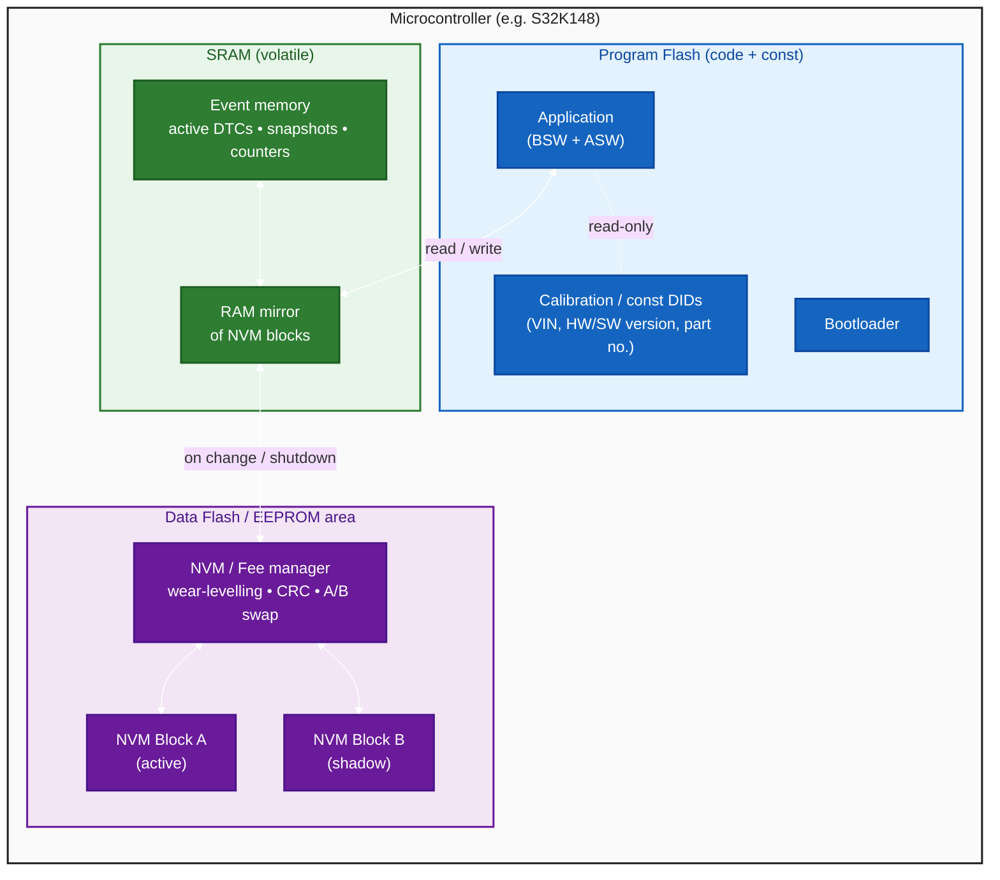
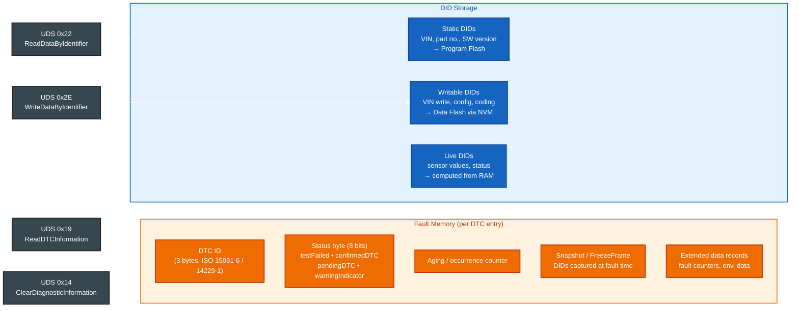
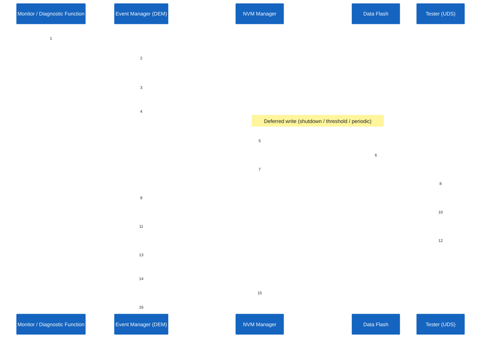
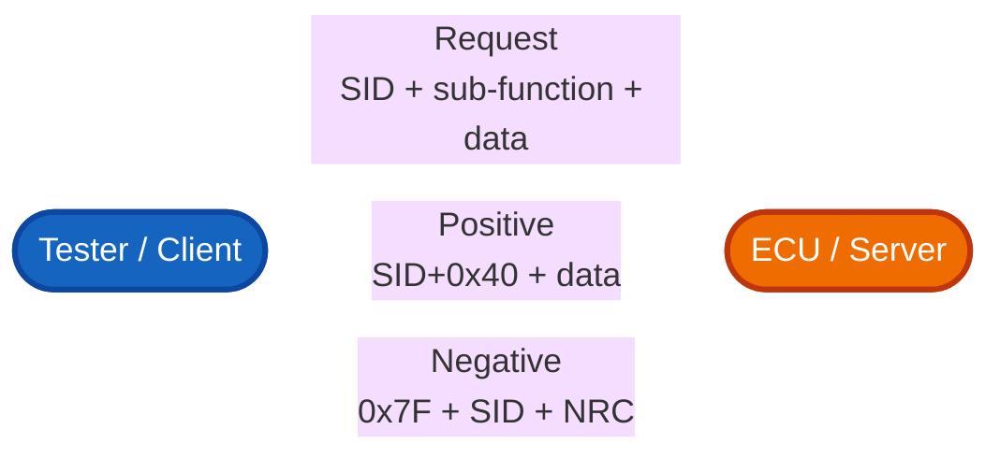
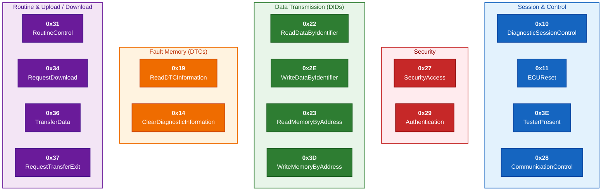
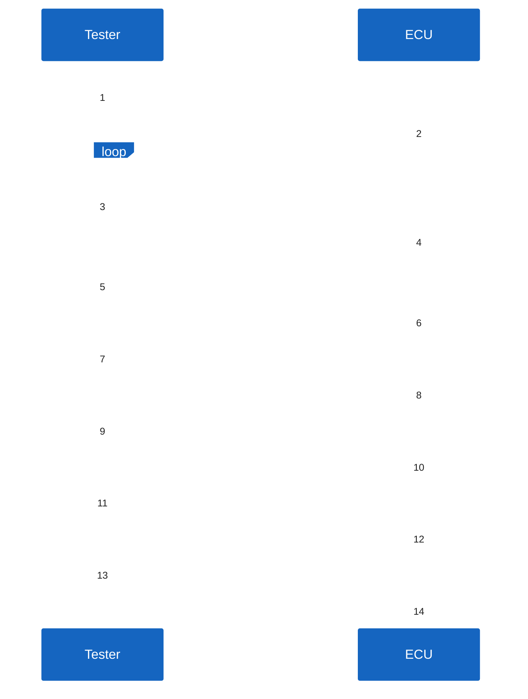
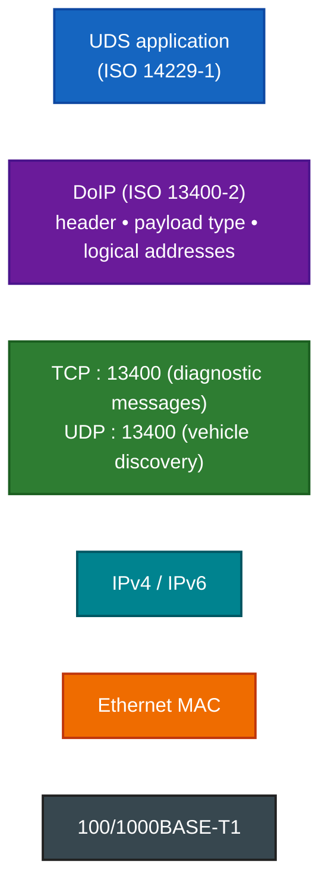
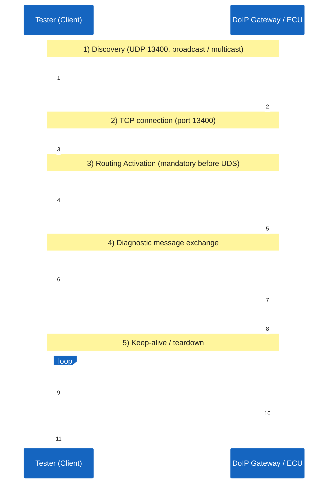

# ECU Fault Memory in Embedded Flash

A classic automotive ECU has only a small amount of on-chip memory but must
remember **diagnostic data across power cycles**: identification data exposed
via **DIDs** (`0x22 / 0x2E`) and the **fault memory** queried via DTC services
(`0x19`, `0x14`). This is implemented on top of the microcontroller’s
**embedded non-volatile Flash** using a small NVM / EEPROM-emulation layer.

- DID = a named variable in the ECU you can read/write.
- DTC = a logged event that says something went wrong.

# ECU Fault Memory in Embedded Flash

A classic automotive ECU has only a small amount of on-chip memory but must
remember **diagnostic data across power cycles**: identification data exposed
via **DIDs** (`0x22 / 0x2E`) and the **fault memory** queried via DTC services
(`0x19`, `0x14`). This is implemented on top of the microcontroller’s
**embedded non-volatile Flash** using a small NVM / EEPROM-emulation layer.

## Memory map of a typical ECU

**Key idea:** the application never writes to Flash directly. It works on a
**RAM mirror**; an NVM manager periodically (or on shutdown / on event)
serializes the dirty blocks into Data Flash, protected by a **CRC** and an
**A/B (ping-pong)** scheme so a power loss during the write cannot corrupt the
last good copy.

## What lives in fault memory

## Lifecycle of a DTC: detection → storage → readout → clear

## Why this layered design

* **Endurance** — embedded Flash supports only ~10⁴–10⁵ erase cycles per
  sector. A RAM mirror + deferred write + wear-levelling keeps the cell count
  low.
* **Power-fail safety** — A/B (ping-pong) sectors with CRC ensure the previous
  valid copy survives if power is lost mid-write.
* **Determinism** — the application reads/writes RAM at runtime; Flash access
  (slow, blocking) happens only in the NVM manager.
* **Standard separation** — UDS services (`0x19`, `0x14`, `0x22`, `0x2E`) only
  see logical IDs; the physical layout in Flash is hidden behind the NVM/DEM
  layer (in AUTOSAR: NvM + Fee + Fls under Dem).

# UDS — Unified Diagnostic Services (ISO 14229)

UDS is a **request/response** protocol used by a diagnostic **Tester (Client)**
to talk to one or more **ECUs (Servers)** in a vehicle. Every request is a
single byte **Service Identifier (SID)**; the positive response is `SID + 0x40`,
a negative response is the fixed byte `0x7F` followed by the original SID and a
**Negative Response Code (NRC)**.

## Request / Response model

## Core service groups

Services are grouped by purpose. Each box shows the SID and the service name.

## Typical session lifecycle

## Negative Response Codes (most common)

| NRC  | Name                                     |
|------|------------------------------------------|
| 0x10 | generalReject                            |
| 0x11 | serviceNotSupported                      |
| 0x12 | subFunctionNotSupported                  |
| 0x13 | incorrectMessageLengthOrInvalidFormat    |
| 0x22 | conditionsNotCorrect                     |
| 0x31 | requestOutOfRange                        |
| 0x33 | securityAccessDenied                     |
| 0x35 | invalidKey                               |
| 0x78 | requestCorrectlyReceived-ResponsePending |

# DoIP — Diagnostics over IP (ISO 13400)

DoIP is the **transport layer** that carries UDS messages over standard IP
networks (typically automotive Ethernet). It replaces ISO-TP / CAN for high-
bandwidth use cases such as ECU flashing, vehicle-wide diagnostics through a
central gateway, and remote / off-board diagnostics.

## Core concepts

* **Vehicle discovery** over UDP broadcast / multicast (port **13400**)
  – the tester learns which DoIP entities exist and their **Logical Address**.
* **Diagnostic communication** over a TCP connection (port **13400**)
  carrying length-prefixed DoIP messages with a UDS payload.
* **Routing Activation** authorizes the TCP socket and binds the tester’s
  **Source Address** to the connection before any UDS traffic flows.
* **Logical Addresses** identify the *Tester* (e.g. `0x0E00`) and the
  *target ECU / Gateway* (e.g. `0x1234`) — independent of IP addressing.
* A **DoIP Gateway** can route UDS messages from Ethernet onto an internal
  CAN bus to reach legacy ECUs (mixed topologies).

## Protocol stack

## End-to-end message flow

This is exactly the pattern visible in a Wireshark capture of a DoIP session:
*Vehicle announcement (UDP) → TCP handshake → Routing activation request /
response → Diagnostic message + ACK → reply → FIN*.

## Common DoIP payload types

| Type   | Direction      | Meaning                                |
|--------|----------------|----------------------------------------|
| 0x0000 | T ↔ G          | Generic DoIP header negative ACK       |
| 0x0001 | T → G (UDP)    | Vehicle Identification Request         |
| 0x0004 | G → T (UDP)    | Vehicle Announcement / Ident. Response |
| 0x0005 | T → G (TCP)    | Routing Activation Request             |
| 0x0006 | G → T (TCP)    | Routing Activation Response            |
| 0x0007 | T → G          | Alive Check Request                    |
| 0x0008 | G → T          | Alive Check Response                   |
| 0x8001 | T ↔ G          | Diagnostic Message (carries UDS)       |
| 0x8002 | G → T          | Diagnostic Message Positive ACK        |
| 0x8003 | G → T          | Diagnostic Message Negative ACK        |

## Why DoIP?

* **Bandwidth** — flashing a modern ECU over CAN is too slow; Ethernet/DoIP
  reaches hundreds of Mbit/s.
* **Topology** — a single Ethernet link to a central gateway can reach every
  ECU in the vehicle, including legacy CAN nodes via routing.
* **Off-board access** — works natively over standard IP networks, enabling
  remote, plant, and service-bay diagnostics without proprietary hardware.
* **Reuses UDS** — application-level diagnostic logic (DIDs, routines, DTCs,
  flashing) is unchanged; only the transport differs.

