# SOVD Demo — Architecture & Design

This document describes the architecture of the OpenBSW + SOVD demo, the key
design choices made during integration, and the DoIP communication flow
including error patterns encountered and their solutions.

> **Requirements traceability**: Each section references the corresponding
> requirement group from [`requirements-summary.md`](requirements-summary.md).

---

## 1. System Architecture

*Covers: [RG-1], [RG-2], [RG-4], [RG-5]*

```mermaid
flowchart TB
  subgraph host[Host / Dev-Container]
        ecu["OpenBSW ECU (C++)<br/>app.sovdDemo.elf<br/>POSIX-FreeRTOS<br/>lwIP TCP/IP stack<br/>Logical addr: 0x002A<br/>IP: 192.168.0.201"]
        cda["OpenSOVD CDA (Rust)<br/>opensovd-cda<br/>axum HTTP server<br/>DoIP client<br/>Tester addr: 0x0EE0<br/>IP: 192.168.0.10"]
        bridge["doip-net bridge<br/>(or host networking for local mode)"]
        grafana["Grafana<br/>192.168.0.100<br/>:3000<br/>Infinity datasource"]
  end

  ecu <-->|DoIP TCP :13400 over tap0| cda
  ecu -->|tap0 (L2 TAP interface)<br/>192.168.0.0/24 subnet| bridge
  cda --> bridge
  bridge --> grafana

    sovd["External access<br/>SOVD API: http://localhost:8080/vehicle/v15/..."] -->|REST :8080| cda
    ui["External access<br/>Grafana: http://localhost:3000"] --> grafana
```

### Component Summary

| Component | Technology | Role |
|:---|:---|:---|
| **OpenBSW ECU** | C++, POSIX-FreeRTOS, lwIP | Simulates ECU with UDS diagnostic services over DoIP |
| **OpenSOVD CDA** | Rust, axum, tokio | Translates SOVD REST API to UDS/DoIP diagnostic commands |
| **Grafana** | Docker, Infinity datasource | Visualises live sensor data and faults |
| **tap0** | Linux TAP interface | Provides L2 Ethernet connectivity for the ECU's lwIP stack |
| **MDD file** | FlatBuffers binary | ECU diagnostic description consumed by the CDA |

---

## 2. Software Stack Layers

*Covers: [RG-1], [RG-2], [RG-4]*

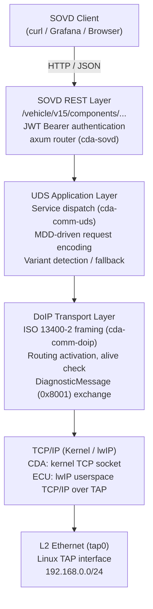

---

## 3. CMake Overlay Strategy (Zero-Patch)

*Covers: [RG-1.1], [RG-5.4]*

The demo builds on top of upstream OpenBSW without modifying its source tree:

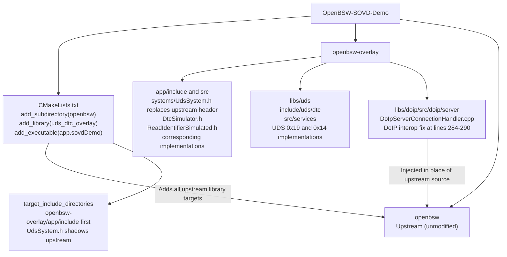

**Key insights**:

1. The overlay include path takes precedence over the upstream include path.
   The demo's `UdsSystem.h` shadows the upstream version.
2. For the DoIP fix, the upstream `DoIpServerConnectionHandler.cpp` is excluded
   from the `doip` library target via `SOURCES` property manipulation, and the
   overlay copy (with the interop fix) is injected in its place. The upstream
   file remains **completely unmodified**.

All other upstream sources are compiled as-is.

---

## 4. DoIP Communication Flows

*Covers: [RG-4], [RG-6]*

### 4.1 Good Case — Successful DID Read

This is the working end-to-end flow for reading a sensor value
(e.g. `GET /vehicle/v15/components/openbsw/data/EngineTemp`):

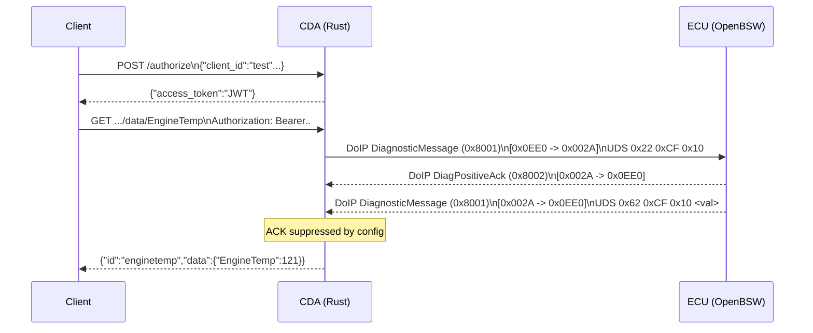

**Key points**:
- ECU sends `DiagnosticMessagePositiveAck` (0x8002) to confirm receipt
- ECU sends UDS positive response `0x62` (SID + 0x40) with the DID data
- CDA's outbound ACK to the ECU is suppressed (`send_diagnostic_message_ack = false`)

### 4.2 Good Case — Fault Memory Read

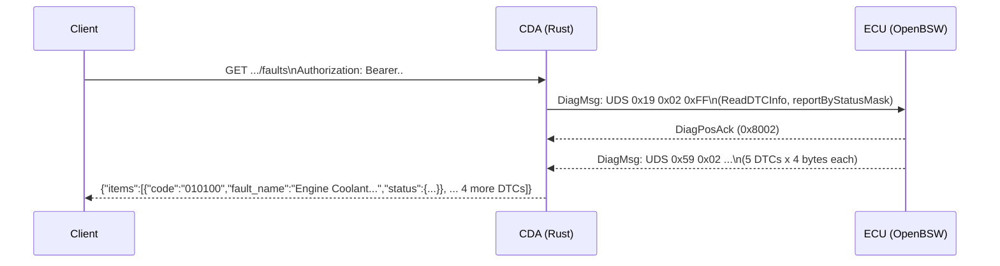

### 4.3 Good Case — DoIP Connection Establishment

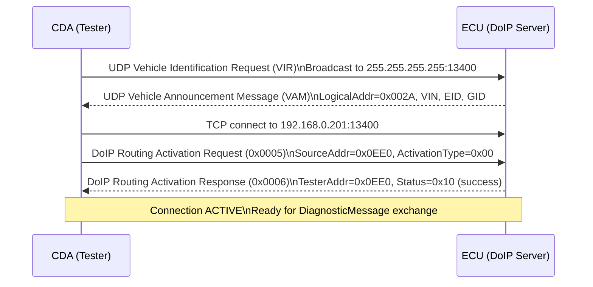

---

## 5. Error Patterns & Solutions

*Covers: [RG-6]*

### 5.1 ERR-1: DoIP Generic NACK on DiagnosticMessageAck (RESOLVED)

**Root cause**: After receiving a UDS response from the ECU, the CDA sends a
`DiagnosticMessagePositiveAck` (payload type `0x8002`) back on the TCP stream.
The ECU's `DoIpServerConnectionHandler::headerReceivedDefault()` did not
recognise this payload type and responded with Generic NACK code `0x01`
(unknown payload type).

**Impact**: The NACK corrupted the CDA's response stream. Subsequent UDS
requests would either timeout or receive garbled data.

*Requirement: [RG-6.1], [RG-6.2]*

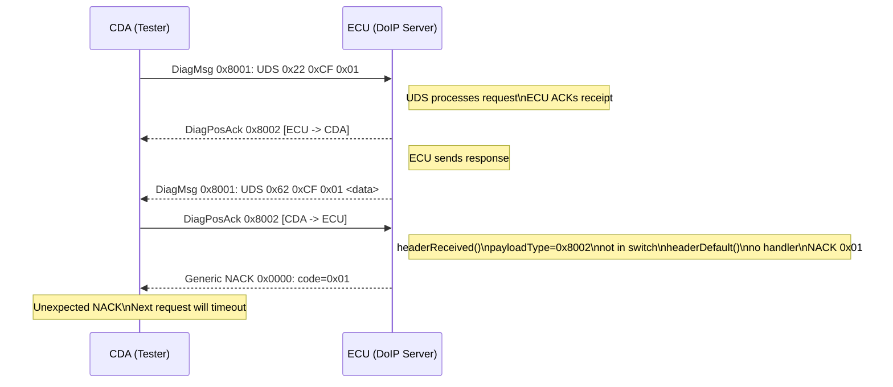

**Solution (two-sided)**:

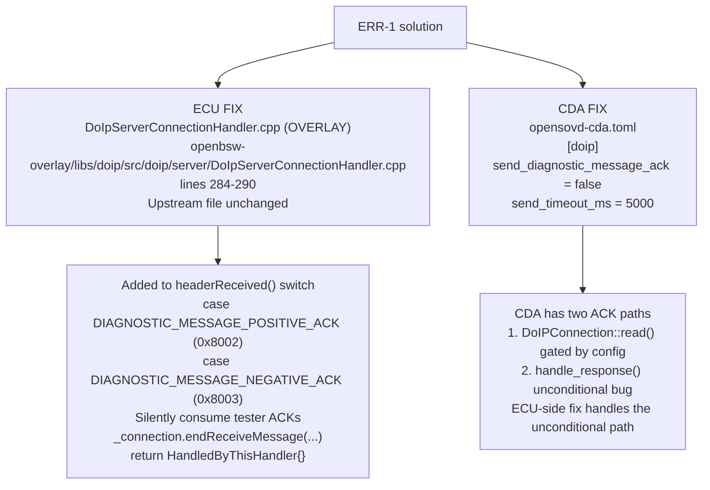

### 5.2 ERR-2: ECU Process Stopped (SIGTTOU) (RESOLVED)

**Root cause**: The POSIX FreeRTOS ECU application calls `tcsetattr()` in
`Uart::init()` to disable canonical mode and echo on stdout. When the process
runs in the background (`&`), the kernel delivers `SIGTTOU` (signal 22), whose
default action is to stop the process.

**Impact**: ECU stuck at "Initialize level 1" with process state `Tl`
(stopped + multi-threaded). No FreeRTOS tasks run. No DoIP server.

*Requirement: [RG-6.4]*

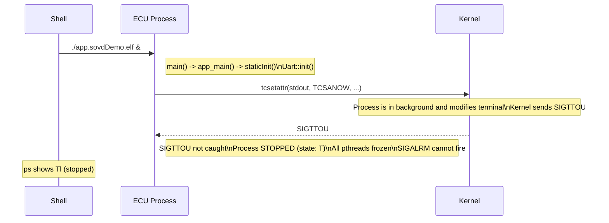

**Solution**:

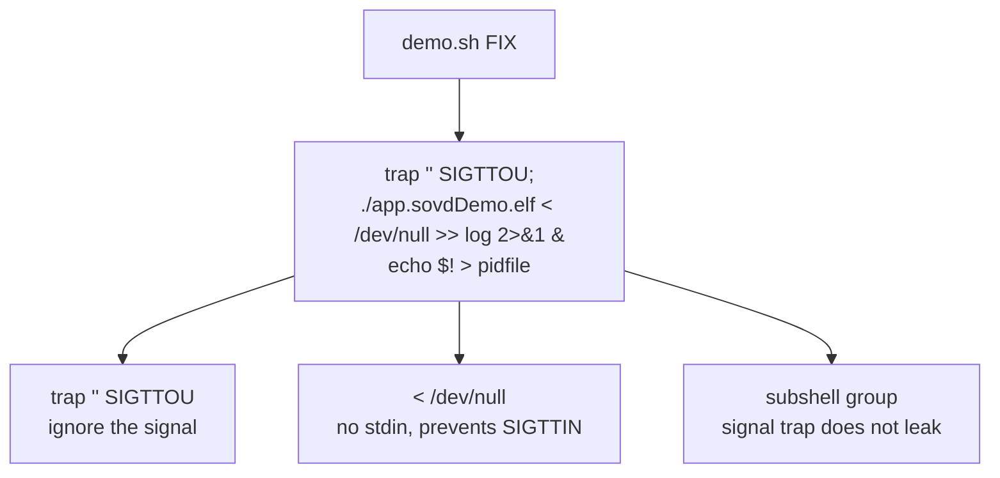

### 5.3 ERR-3: UDS Request Out of Range (DID Mismatch) (KNOWN)

**Root cause**: The MDD file maps `Identification_Read` to DID `0xF100`, but
the ECU only registers DIDs `0xCF01`–`0xCF12`. The ECU returns UDS NRC `0x31`
(requestOutOfRange).

**Impact**: Reading the `Identification` data item fails. All other 6 DIDs
work correctly.

*Requirement: [RG-7.1]*

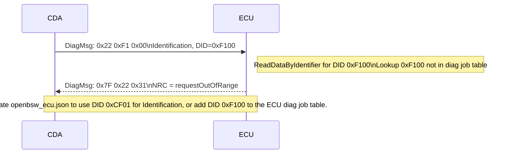

### 5.4 ERR-4: Variant Detection Failure (MITIGATED)

**Root cause**: The MDD file defines an empty `variant_pattern: []`. The CDA's
variant detection sends a specific DID read to determine which diagnostic
variant to use. With no pattern, it cannot detect any variant.

**Impact**: CDA logs `Variant detection error: Failed to detect variant:
NotFound(None)`. Falls back to the base variant, which works for this single-ECU
demo but may miss variant-specific services in a multi-variant setup.

*Requirement: [RG-2.11]*

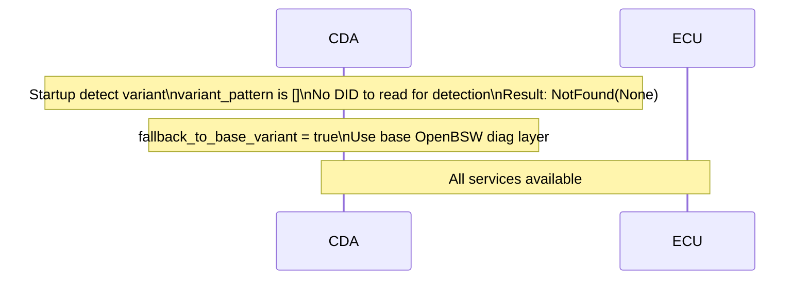

### 5.5 ERR-5: AliveCheck NACK (30-second interval) (COSMETIC)

**Root cause**: The CDA sends DoIP `AliveCheckRequest` (payload type `0x0007`)
every 30 seconds to verify the gateway is live. The ECU's DoIP server handles
`AliveCheckResponse` (0x0008) from testers but does not handle unsolicited
`AliveCheckRequest` from a tester — it falls to `headerReceivedDefault()` and
NACKs.

**Impact**: Cosmetic — logged as a warning but does not break communication.
The CDA reconnects if it doesn't receive a response.

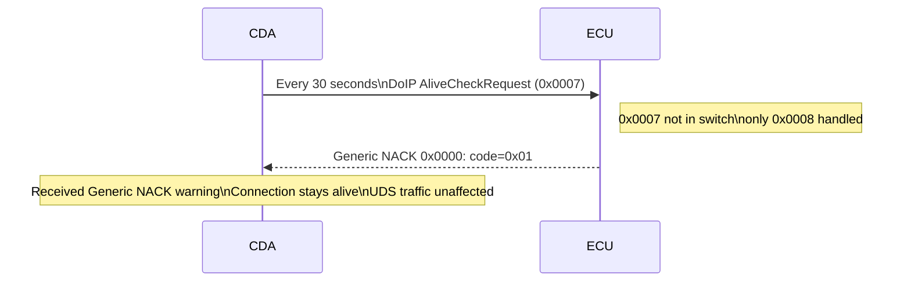

### 5.6 ERR-6: Grafana "No Data" — Bridge Network Cannot Reach localhost (RESOLVED)

**Root cause**: In `demo.sh --real-cda` mode, Grafana runs as a Docker
container on the default **bridge** network (with `-p 3000:3000`), while the
CDA runs on **host** networking. The Infinity datasource panel URLs were
configured as `http://localhost:8080`, which inside the bridge-networked
Grafana container resolves to the container itself — not the host where the
CDA listens.

**Impact**: All Grafana dashboard panels showed "No data". The CDA was healthy
and responding to `curl` from the host, but unreachable from Grafana's
perspective.

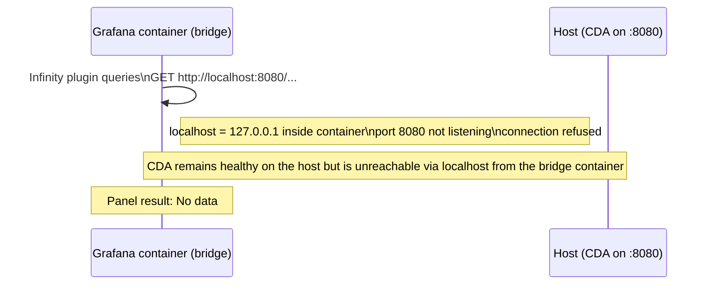

**Solution**: Changed all panel URLs in `grafana/dashboards/openbsw.json`
from `http://localhost:8080` to `http://host.docker.internal:8080` and added
the new host to the datasource's `allowedHosts` in
`grafana/provisioning/datasources/sovd.yaml`. The `--add-host=host.docker.internal:host-gateway`
flag in the `docker run` command (already present in `demo.sh`) ensures this
hostname resolves to the host's gateway IP.

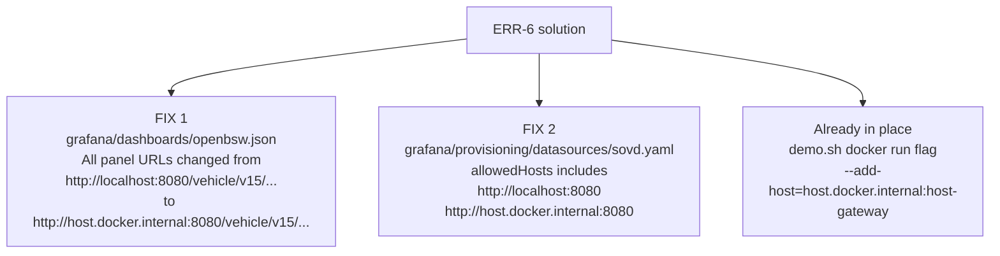

---

## 6. Configuration Reference

*Covers: [RG-2], [RG-6]*

### 6.1 CDA Configuration (`opensovd-cda.toml`)

```toml
# Standard DoIP protocol (not DOBT)                     → [RG-6.5]
onboard_tester = false
flash_files_path = "/app/flash"

[server]
address = "0.0.0.0"
port = 8080                                              # → [RG-2.1]

[database]
path = "/app/odx"                                        # → [RG-2.10]
exit_no_database_loaded = true
fallback_to_base_variant = true                          # → [RG-2.11]

[doip]
tester_address = "192.168.0.10"
tester_subnet = "255.255.0.0"
gateway_port = 13400                                     # → [RG-4.1]
send_diagnostic_message_ack = false                      # → [RG-6.2]
send_timeout_ms = 5000                                   # → [RG-6.3]
```

### 6.2 ECU DoIP Overlay Fix

File: `openbsw-overlay/libs/doip/src/doip/server/DoIpServerConnectionHandler.cpp`
(replaces `openbsw/libs/bsw/doip/src/doip/server/DoIpServerConnectionHandler.cpp`
at build time — upstream file is **not modified**)

Lines 284-290 — added to `headerReceived()` switch, before `default:`:         → [RG-6.1]

```cpp
case DoIpConstants::PayloadTypes::DIAGNOSTIC_MESSAGE_POSITIVE_ACK:   // line 284
case DoIpConstants::PayloadTypes::DIAGNOSTIC_MESSAGE_NEGATIVE_ACK:   // line 285
{                                                                    // line 286
    // Silently consume diagnostic ACKs sent by the tester           // line 287
    _connection.endReceiveMessage(                                   // line 288
        IDoIpConnection::PayloadDiscardedCallbackType());
    return HeaderReceivedContinuation{                               // line 289
        IDoIpConnectionHandler::HandledByThisHandler{}};
}                                                                    // line 290
```

CMake mechanism (in `CMakeLists.txt`):

```cmake
# Remove upstream source from the doip target, inject overlay copy
get_target_property(_doip_srcs doip SOURCES)
list(FILTER _doip_srcs EXCLUDE REGEX "DoIpServerConnectionHandler\\.cpp$")
...
target_sources(doip PRIVATE ${_doip_srcs} <overlay path>)
```

### 6.3 ECU Launch Command

```bash
# → [RG-6.4]
(trap '' SIGTTOU;
 ./build/posix-freertos-sovd/Release/app.sovdDemo.elf \
   < /dev/null >> /tmp/openbsw-demo.log 2>&1 &
 echo $! > /tmp/openbsw-demo.pid)
```

---

## 7. Data Model

*Covers: [RG-7]*

### 7.1 UDS Service Map

| SID | Service | Source | DID/DTC Hex |
|:---:|:---|:---|:---|
| 0x10 | DiagnosticSessionControl | upstream | — |
| 0x14 | ClearDiagnosticInformation | overlay | 0xFFFFFF (all) |
| 0x19 | ReadDTCInformation | overlay | subfns 0x01, 0x02, 0x06 |
| 0x22 | ReadDataByIdentifier | upstream + overlay | 0xCF01–0xCF12 |
| 0x28 | CommunicationControl | upstream | — |
| 0x2E | WriteDataByIdentifier | upstream | 0xCF03 |
| 0x31 | RoutineControl | upstream | subfns 0x01, 0x02, 0x03 |
| 0x3E | TesterPresent | upstream | — |

### 7.2 DID Map (MDD → ECU)

| MDD Name | MDD DID | ECU DID | Match | SOVD Endpoint |
|:---|:---:|:---:|:---:|:---|
| StaticData | 0xCF01 | 0xCF01 | ✓ | `.../data/StaticData` |
| ADC_Value | 0xCF02 | 0xCF02 | ✓ | `.../data/ADC_Value` |
| WritableData | 0xCF03 | 0xCF03 | ✓ | `.../data/WritableData` |
| EngineTemp | 0xCF10 | 0xCF10 | ✓ | `.../data/EngineTemp` |
| BatteryVoltage | 0xCF11 | 0xCF11 | ✓ | `.../data/BatteryVoltage` |
| VehicleSpeed | 0xCF12 | 0xCF12 | ✓ | `.../data/VehicleSpeed` |
| Identification | 0xF100 | — | ✗ | `.../data/Identification` (NRC 0x31) |

### 7.3 DTC Map

| DTC Number | MDD Name | ECU Constant | Simulated Status |
|:---:|:---|:---|:---|
| 0x010100 | Engine Overtemp | `DTC_ENGINE_OVERTEMP` | Random toggle |
| 0x010200 | Battery Low | `DTC_BATTERY_VOLTAGE_LOW` | Random toggle |
| 0x010300 | Comm Fault | `DTC_COMMUNICATION_FAULT` | Random toggle |
| 0x010400 | Sensor Malfunction | `DTC_SENSOR_MALFUNCTION` | Random toggle |
| 0x010500 | Brake Fault | `DTC_BRAKE_SYSTEM_FAULT` | Random toggle |

---

## 8. Deployment Modes

*Covers: [RG-5]*

### 8.1 Local (`demo.sh --real-cda`)

```mermaid
flowchart TB
  subgraph host_os[Host OS (Ubuntu / Dev-Container)]
        tap["tap0 interface<br/>192.168.0.10/24"]
        ecu_proc["ECU process<br/>native binary"]
        cda_host["CDA Docker container<br/>--network host"]
        grafana_local["Grafana Docker container"]
  end
```

### 8.2 Docker Compose (`docker compose --profile real-cda up`)

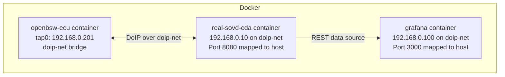

### 8.3 GitHub Codespaces

Same as local mode with port forwarding via `*.app.github.dev` URLs.
Ports 8080 and 3000 must be set to "Public" in the Ports tab.

---

## 9. Pre-built CDA Binary

*Covers: [RG-5.9]*

A pre-built `opensovd-cda` binary (x86-64 Linux, unstripped, ~26 MB) is
checked into `real-sovd-cda/bin/` via **Git LFS**. The Dockerfile supports
a `USE_PREBUILT` build arg:

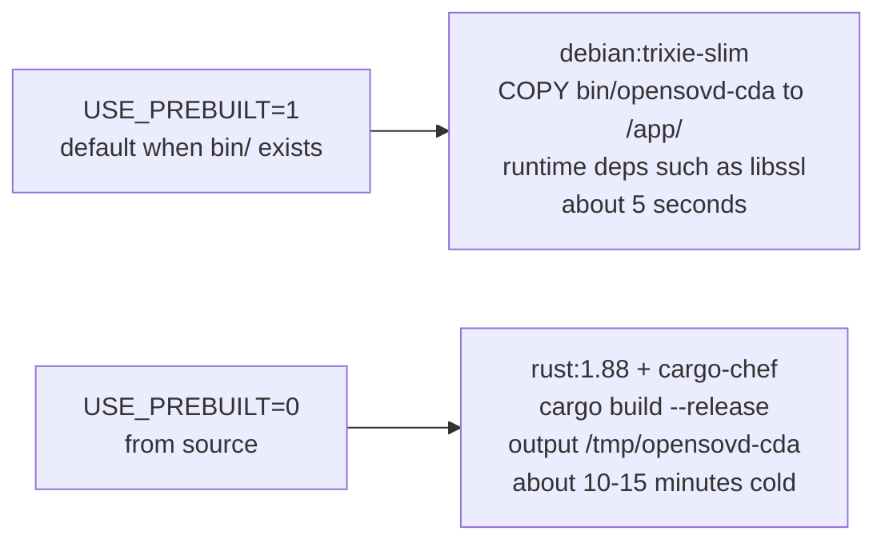

`demo.sh` auto-detects the pre-built binary and uses the fast path.

---

## 10. Dual Grafana Dashboards

*Covers: [RG-8.1], [RG-8.5]*

Two provisioned dashboards are available, one per CDA mode:

| Dashboard | File | UID | Endpoints | Auth |
|:---|:---|:---|:---|:---|
| **OpenBSW Vehicle Diagnostics** | `openbsw.json` | `openbsw-sovd-demo` | `/vehicle/v15/...` | JWT Bearer |
| **OpenBSW Vehicle Diagnostics (Stub CDA)** | `openbsw-stub.json` | `openbsw-stub-cda` | `/api/sensors/...` | None |

Both are provisioned from `grafana/dashboards/` and appear in the Grafana
dashboard list. Select the one matching the running CDA mode.
